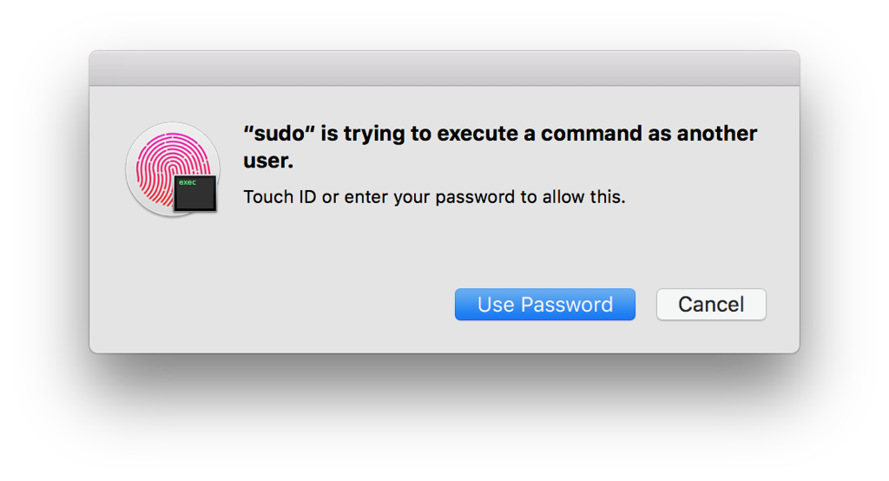

A PAM module for authentication with Touch ID.  

The module takes an optional parameter: "reason".  
Its value will be shown in the dialog presented to the user.  
If the argument is omitted, generic text is used.

*Warning*:  
Do not procede unless you're 1,000,000% sure what you're doing.  
If you're only 999,999% sure, then turn back now.

# Installation
1. Build the project
2. Copy `pam_touchid.so.2` to `/usr/local/lib/pam/` and set:
     * Permissions: 444
     * Owner: root
     * Group: wheel

# Configuring sudo to use it
1. Open up`/etc/pam.d/sudo` in your favourite text editor
2. Add `auth sufficient pam_touchid.so reason="execute a command as another user"` to the top of the file

The procedure is pretty much the same for any other process, but you'd edit a different config file and probably change the reason too.

# If you get locked out of sudo
1. Feel bad that you lied about being 1,000,000% sure what you're doing
2. Enable the root user through system preferences and use `su` to put the config file back